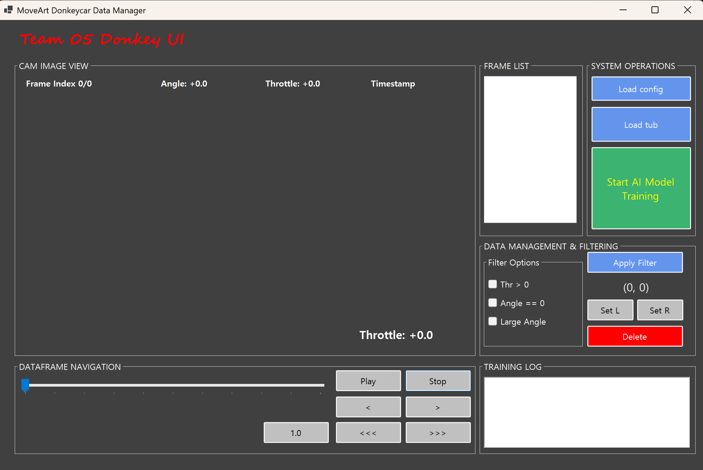
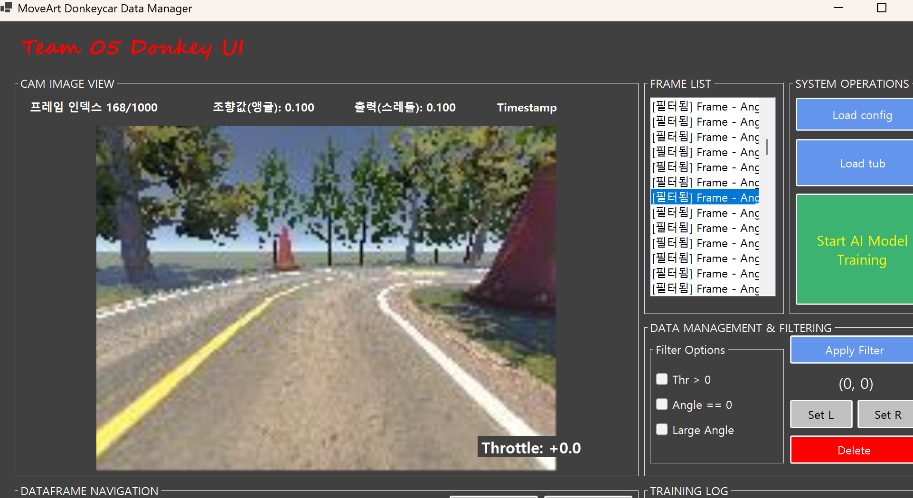
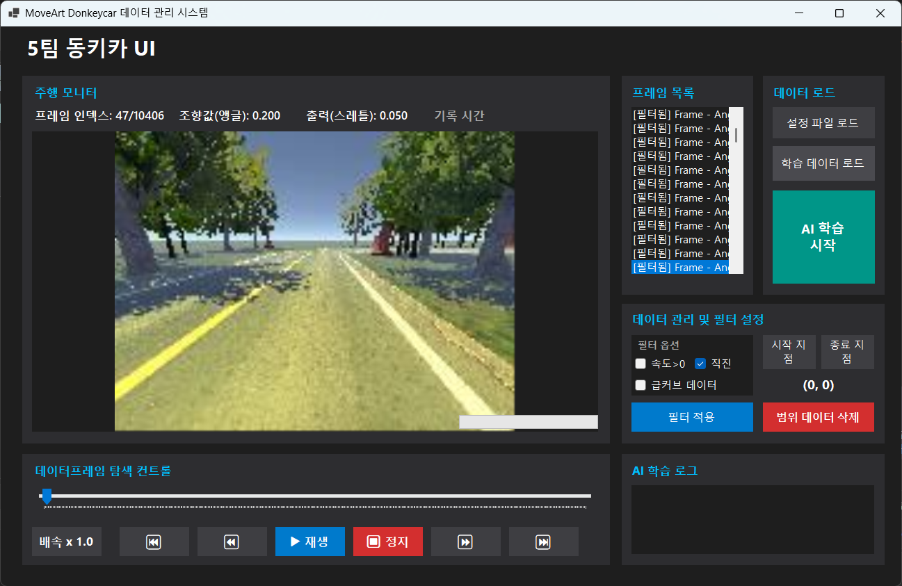
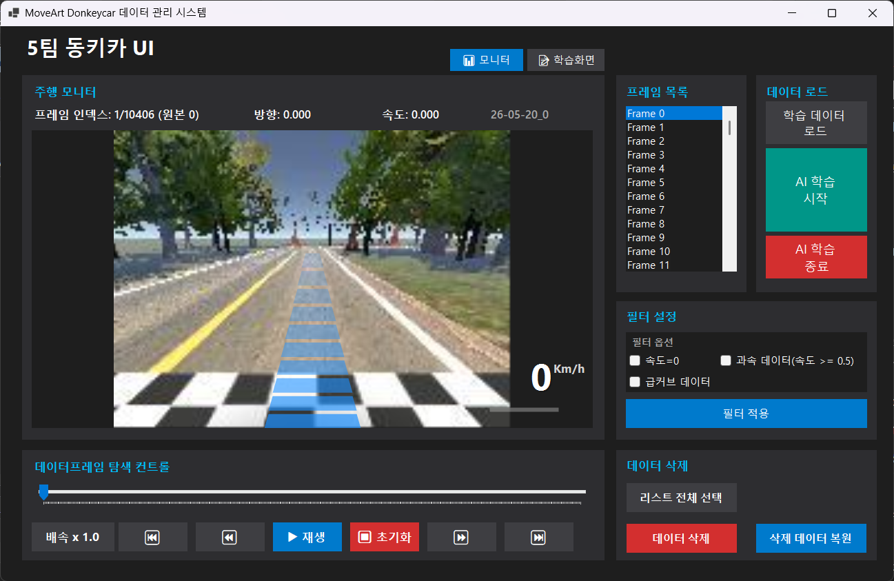
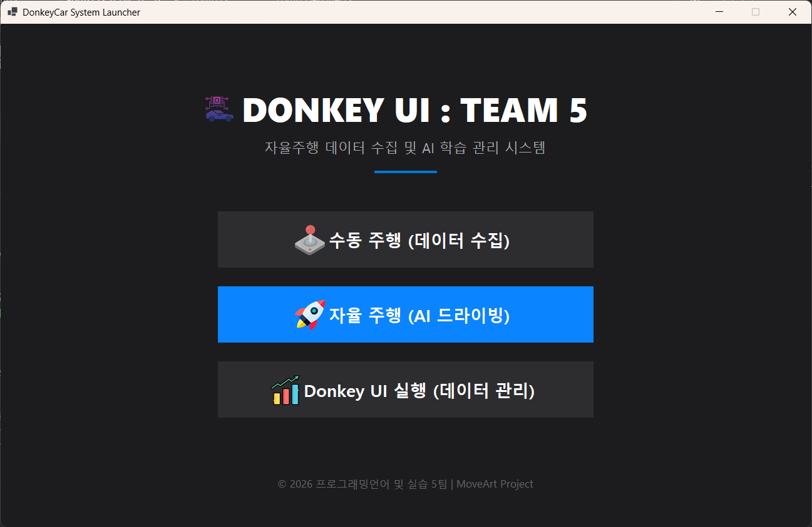
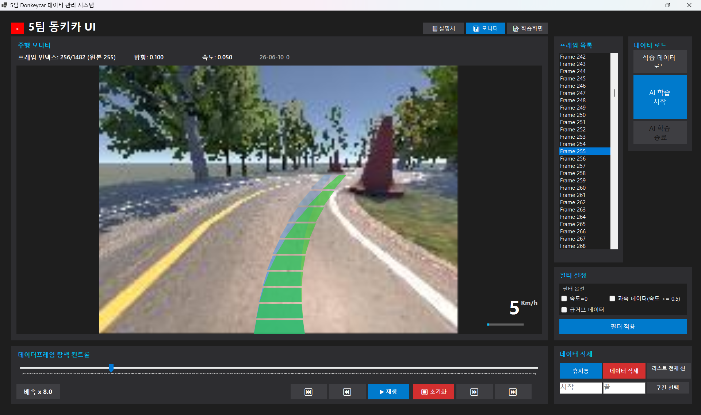

# 🚗 DonkeyCar 자율주행 통합 데이터 제어 및 실시간 관제 시스템
<p align="center">
  
  
  
  
</p>

## 📝 프로젝트 개요 (Overview)
**DonkeyCar 자율주행 통합 데이터 제어 및 실시간 관제 시스템**은 자율주행 RC카(DonkeyCar)의 주행 데이터셋을 시각적으로 모니터링하고, AI 모델의 효과적인 학습을 위해 데이터를 정제·분석하며 관제할 수 있는 **C# WinForms 및 Python 기반의 통합 데스크톱 애플리케이션**입니다.

카메라가 수집하는 주행 이미지와 제어 모듈이 발생시키는 조향·속도 데이터(Catalog) 간 매핑을 기반으로 학습을 진행하는 행동 복제(Behavioral Cloning) 기반의 딥러닝 자율주행 프레임워크를 효율적으로 제어합니다. WSL(Windows Subsystem for Linux) 연동을 통해 백엔드에서 AI 모델을 직접 학습시키고 실시간 오차율 그래프를 그리며, AI의 예측 주행 경로를 원본 경로와 1:1로 비교 시각화하는 강력한 데이터 파이프라인을 제공합니다.

---

## 📌 목차 (Table of Contents)
1. [주요 기능](#-주요-기능-key-features)
2. [핵심 기술 및 구현 알고리즘 (8대 핵심 로직)](#-핵심-기술-및-구현-알고리즘-8대-핵심-로직)
3. [기술 스택](#-기술-스택-tech-stack)
4. [디렉토리 구조](#-디렉토리-구조-project-structure)
5. [시작하기 및 실행 방법](#-시작하기-getting-started)
6. [팀 구성 및 역할 분담](#-팀-구성-및-역할-team-members)
7. [진행 상황 및 스크린샷](#-진행-상황-및-스크린샷-progress)

---

## ✨ 주요 기능 (Key Features)
* **대용량 주행 데이터 비동기 매핑:** `.catalog`, `.json` 데이터 파싱과 수만 장의 대용량 이미지 로드 시 UI 프리징 현상을 완벽히 차단.
* **미디어 플레이어 기반 관제 UX:** 주행 데이터의 재생/정지 제어 및 배속 제어(최대 8배속)를 지원하며 라벨과 슬라이더 간 유기적 동기화 구현.
* **정밀 다중 필터링 (AND 방식):** 무가속 구간, 급커브 구간, 강한 가속 구간 등 원하는 조건의 학습 데이터셋만 직관적으로 추출.
* **안전한 데이터 정제 시스템:** 단일/다중 프레임 삭제 시 즉각 반영되지 않고 휴지통 백업 및 복구 단계를 거치도록 설계하여 데이터 유실 방지.
* **WSL 기반 AI 학습 제어 및 실시간 관제:** C# WinForms UI 내에서 Linux 환경의 `train.py`를 비동기 구동하고 실시간 로그 파싱 및 오차율(Loss) 그래프를 출력.
* **AI 예측 경로 시각화 비교:** 학습된 `.h5` 모델 파일 기반의 예측값과 원본 주행 경로를 GDI+ 그래픽 인터페이스 상에 1:1 매칭하여 시각적 성능 비교 가능.

---

## 🧠 핵심 기술 및 구현 알고리즘 (8대 핵심 로직)

### 1. 비동기 데이터 로드 및 경로 매핑
* `catalog_X.catalog` 파일을 라인 단위로 읽어 JSON 형식의 조향각, 가속도, 이미지 매핑 데이터를 파싱합니다.
* 하드디스크 내 실제 파일 경로와 매핑 연산 시 발생할 수 있는 UI 프리징을 방지하기 위해 `Task.Run` 멀티스레딩을 적용했습니다.
```csharp
_masterFrameList = await Task.Run(() => _dataProcessor.LoadCatalogData(selectedPath));
```

### 2. 미디어 플레이어형 재생 및 배속 제어
* 타이머 틱(Tick) 주기마다 프레임을 한 단계씩 전진시키며 리스트박스, 슬라이더, 픽처박스 화면을 동시 갱신합니다.
* 배속은 `0.5x → 1x → 2x → 4x → 8x` 순으로 순환하며, 과도한 하드웨어 부하를 방지하기 위해 최소 인터벌을 50ms로 제한합니다.
```csharp
_playbackTimer.Interval = Math.Max(50, (int)Math.Round(BasePlaybackIntervalMs / speed));
```

### 3. 교집합(AND) 방식 다중 데이터 필터링
* 원본 리스트의 불변성을 유지하기 위해 복사본(`filteredList`)을 생성한 후 사용자가 선택한 필터 조건들을 순차적으로 적용합니다.
* `Thr == 0` (정지/무가속), `|Angle| >= 0.5` (급커브), `Throttle >= 0.5` (강한 가속) 등의 조건을 교집합 형태로 필터링합니다.
```csharp
filteredList = filteredList.FindAll(frame => frame.Throttle == 0);
```

### 4. Win32 API 기반 리스트 다중 및 구간 선택
* 대량의 행을 연속 선택하거나 전체 선택할 때 속도 저하를 막기 위해 유기적인 인덱싱 수집 및 Win32 API `LB_SETSEL` 메시지 통신을 활용합니다.
```csharp
SendMessage(lstFrameData.Handle, LB_SETSEL, 1, -1);
```

### 5. 휴지통 대기 및 복원 시스템
* 선택된 프레임들을 메인 주행 데이터에서 즉시 삭제하는 대신 복원이 가능한 임시 저장소(`_trashFrameList`)로 이동시켜 데이터 정제의 안전성을 보장합니다.
```csharp
_trashFrameList.AddRange(selectedFrames);
```

### 6. WSL 프로세스 연동 및 정규식 로그 파싱
* `wsl.exe` 프로세스를 백그라운드로 실행하여 리눅스 환경 내부의 `train.py`를 비동기 호출합니다.
* 출력되는 표준 스트림 로그에서 정규표현식을 통해 학습 손실값(`loss`) 패턴을 실시간 파싱합니다.
```csharp
var match = System.Text.RegularExpressions.Regex.Match(logText, @"loss:\s*([0-9\.]+)");
```

### 7. 다크 테마 오차율 실시간 그래핑
* 실시간으로 추출된 `loss` 수치 데이터를 수집하여, WinForms Chart 컨트롤에 다크 테마 스타일이 적용된 선 그래프(Series)로 동적 렌더링합니다.
```csharp
ChartRealTime.ChartAreas["LossArea"].AxisY.Minimum = double.NaN;
```

### 8. GDI+ 기반 AI 예측 경로 비교 시각화
* WSL을 통해 모델 파일(`.h5`)과 `predict_all.py`를 실행하여 획득한 JSON 결과 배열을 수집합니다.
* 원본 경로(파란색)와 AI 예측 경로(초록색)를 화면 상에 다각형(Polygon) 형태로 겹쳐서 다이내믹하게 드로잉합니다.
```csharp
g.FillPolygon(aiBrush, polyA);
```

---

## 🛠 기술 스택 (Tech Stack)

| Category | Technology |
| :--- | :--- |
| **Frontend/UI** | Windows Forms (C# / .NET), GDI+ Graphics, MSChart Controls |
| **Backend/Runtime** | .NET Runtime, Python 3.x, WSL (Windows Subsystem for Linux) |
| **Data Processing** | JSON Lines 파싱 (`System.Text.Json`), LINQ Query, Regex (정규표현식) |
| **Deep Learning** | Keras / TensorFlow (Behavioral Cloning 모델 제어, `.h5` 파일 핸들링) |
| **Architecture** | Controller Pattern (UI 컴포넌트와 비즈니스 정제 로직의 독립적 설계) |

---

## 📂 디렉토리 구조 (Project Structure)
```text
DateManager/
 │── DateManager.slnx               # 최신 .NET 솔루션 관리 구성 파일
 │── DateManager.csproj             # 프로젝트 빌드 및 종속성 설정 파일
 │── DateManager.csproj.user        # 개발자별 로컬 디버그/실행 프로파일 설정
 │── Program.cs                     # 애플리케이션 시작 진입점
 │── README.md                      # 프로젝트 문서화 가이드 파일
 │── predict_all.py                 # 학습 완료 모델 기반 조향/가속 예측값 생성 파이썬 스크립트
 │── 여기 안에 있는거 mycar안에 넣기!!!!!! # DonkeyCar 임베디드 배포 및 이동을 위한 작업 메모 파일
 │
 ├── [Forms & UI]                   # 윈도우 폼 및 데스크톱 UI 인터페이스 모듈
 │    ├── LauncherForm.cs           # 앱 시작 런처 폼 (초기 환경 세팅 및 대시보드 진입)
 │    ├── LauncherForm.Designer.cs  # 런처 폼 컴포넌트 자동 배치 스크립트
 │    ├── LauncherForm.resx         # 런처 UI 전용 로컬 리소스
 │    ├── Form1.cs                  # 메인 데이터 관제 및 정제 통합 제어 대시보드 폼
 │    ├── Form1.Designer.cs         # 메인 폼 컴포넌트 자동 배치 스크립트
 │    └── Form1.resx                # 메인 UI 전용 로컬 리소스
 │
 ├── [Core Business Logic]         # 컨트롤러 분할 패턴 기반 핵심 연산 로직 모듈
 │    ├── data.cs                   # 대용량 주행 데이터(.catalog) 비동기 파싱 및 구조체 매핑
 │    ├── Delete.cs                 # 데이터 정제 파이프라인 중 프레임 삭제 조건 연산 제어
 │    ├── Backup.cs                 # 삭제 데이터 복원을 위한 안전한 휴지통 백업/복구 트랜잭션
 │    ├── Trainer.cs                # WSL 백엔드 비동기 AI 프로세스 구동 및 실시간 로그 파싱
 │    └── Picture.cs                # GDI+ 엔진 기반 주행 이미지 렌더링 및 AI 예측 경로 드로잉
 │
 ├── Properties/                    # 프로젝트 어셈블리 및 로컬 정보 관리 폴더
 │    └── AssemblyInfo.cs           # 빌드 메타데이터 및 버전 정보 관리
 │
 ├── Resources/                     # 대시보드 UI 테마 고도화용 디자인 에셋 폴더
 │    ├── Resources.resx            # 리소스 링크 구성 관리 파일
 │    ├── Resources.Designer.cs     # 리소스 자동 인덱싱 생성 코드
 │    └── (ai.png, joystick.png, rocket.png, statistics.png, user-guide.png 등 다수)
 │
 └── img/                           # 레포지토리 문서화용 스크린샷 및 기획 문서
      ├── developmentPlan.pdf       # 프로젝트 핵심 개발 계획서
      ├── screenshot-1.png          # 1단계: 기초 UI 설계 스크린샷
      ├── screenshot-2.png          # 2단계: 미디어 관제 기능 구현 스크린샷
      ├── screenshot-3.png          # 3단계: UI 고도화 V1 스크린샷
      ├── screenshot-4.png          # 4단계: 필터링 및 다크 테마 V2 스크린샷
      └── screenshot-5.png          # 5단계: 통합 UI 홈 화면 및 전체 파이프라인 안착 스크린샷
```

---

## 🚀 시작하기 (Getting Started)

### 요구사항 (Prerequisites)
* Windows 10 / 11 OS
* .NET SDK 또는 .NET Desktop Development 워크로드가 포함된 **Visual Studio 2022 이상**
* **WSL (Windows Subsystem for Linux)** 및 Python 환경 세팅 (Keras/TensorFlow 및 DonkeyCar 라이브러리 설치 필수)

### 실행 방법
1. 본 레포지토리를 클론한 뒤 Visual Studio에서 `DateManager.slnx` 솔루션을 엽니다.
2. `F5` 키를 눌러 빌드 및 애플리케이션을 디버깅/실행합니다.
3. 데이터 폴더를 로드하여 프레임 관리, 휴지통 정제, WSL 기반 AI 학습 및 실시간 오차율 모니터링 기능을 구동합니다.

---

## 👥 팀 구성 및 역할 분담 (Team Members)

### 5조 (Convergence)
* **김재서 (컴퓨터소프트웨어학과) - [팀장 / UI 총괄]**
    * 전체 WinForms UI 레이아웃 설계 및 다크 테마 인터페이스 구축.
    * 사용자 경험(UX) 최적화 및 렌더링 프레임 최적화.
    * 실시간 정제 프로세스를 위한 **휴지통 기능 구조 설계 및 핵심 구현**.
* **박진철 (컴퓨터소프트웨어학과) - [UX / 데이터 담당]**
    * 컨트롤(ListBox, Slider, PictureBox) 간 실시간 매핑 동기화.
    * 대용량 리스트 핸들링을 위한 **단축키 인덱싱 알고리즘 구현**.
    * **구간 다중 선택 로직 및 삭제 프레임 데이터 복원 알고리즘** 담당.
* **윤형규 (컴퓨터소프트웨어학과) - [데이터 정제 담당]**
    * 파일 단위의 단일 및 다중 삭제/백업 물리 로직 처리 구현.
    * 프레임 주행 데이터 미디어형 **재생/정지 및 가속 인터벌 순환 로직** 구현.
    * 학습된 모델 데이터를 받아 활용하는 **AI 예측 경로 시각화 알고리즘** 렌더링 구현.
* **이기주 (컴퓨터소프트웨어학과) - [AI 학습 담당]**
    * WSL 프로세스를 통한 **AI 학습 시작/종료 제어 및 제어 흐름 설계**.
    * 백엔드 Python 출력 스트림의 **AI 학습 로그 실시간 비동기 동기화 및 출력** 구현.
    * 정규식 파싱 데이터를 기반으로 한 **오차율(Loss) 실시간 동적 차트 그래핑 그래프 구현**.

---

## 📈 진행 상황 및 스크린샷 (Progress)

### 1단계: 기초 UI 설계

* 사용자 편의성을 고려한 기본 컨트롤 배치 및 초기 레이아웃 구성

### 2단계: 기능 구현

* 주행 데이터 로드, 파싱 매핑 알고리즘 및 미디어 제어 연동 완료

### 3단계: UI 고도화 (Version 1.0)

* 일관된 디자인 시스템 적용 및 가독성 높은 한글 관제 라벨 최적화

### 4단계: UI 고도화 (Version 2.0)

* 다중 필터링 시스템, 다크 테마 고도화 및 데이터 정제 편의성 향상

### 5단계: 통합 UI 홈 화면 생성

* 관제 시스템 메인 홈 화면 생성 및 안정적인 멀티스레딩 통합 파이프라인 정착

### 6단계: AI학습 및 정답 비교 시각화

* 실제 주행 값과 AI 예측값을 GDI+ 그래픽 인터페이스 상에 1:1 매칭하여 시각적 성능 비교 가능